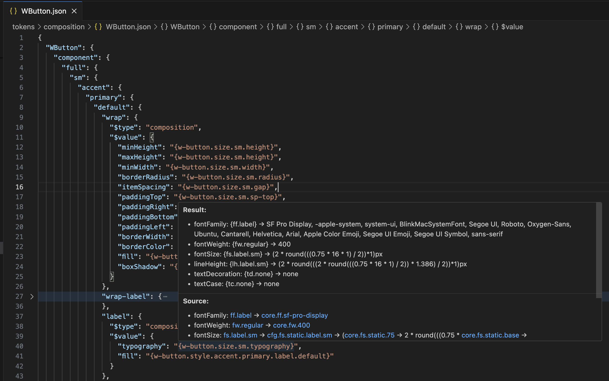

# JsonHint-TS

VSCode Extension for working with [Tokens Studio](https://tokens.studio) JSON tokens directly in VSCode.

---

## ✨ Features

- 🎨 Shows resolved values in hover tooltips
- 🟣 Displays full inheritance and resolution chain
- 🔤 Supports complex types: **typography**, **composition**, **boxShadow**, **color**, **sizing**, **spacing**, **dimension** and others
- 🪄 Auto-completion for `$value` fields
- 🟡 Color preview inside hover and autocomplete
- 🔄 Handles cycles and long chains safely
- 🐇 Optimized for large token collections (5000+ tokens)
- 💼 Full compatibility with Tokens Studio for Figma

---

## 📸 Screenshots

### 🟣 Typography Details
Shows fully resolved typography properties:

### 🎨 Color Tooltip
Instant color preview:

### 📏 Sizing Tooltip
Works with sizing tokens:

### ✨ Typography Autocomplete
Smart autocomplete with resolved tokens:

### ☁️ Box Shadow Source
See how complex boxShadow compositions resolve:

### ☁️ Box Shadow Result
Full visualization of box shadow chain:

### 🎨 Color Resolution
Resolve color composition with full trace:

### 📐 Dimension Tooltip
See all dimensions calculated:

### ➕ Sizing Chain
Full resolution chain for sizing:

---

## ⚙️ Extension Settings

| Setting            | Description                        | Default                                    |
| ------------------ | ---------------------------------- | ------------------------------------------ |
| `inheritanceStyle` | Style of inheritance chain display | `compact`                                  |
| `showIcons`        | Show icons in hover                | `true`                                     |
| `showArrows`       | Show arrows between tokens         | `true`                                     |
| `complexTypes`     | Types rendered as tables           | `["typography","boxShadow","composition"]` |
| `noisyTokens`      | Tokens to exclude from chain       | `["core.ly.tab.base",...]`                 |
| `maxChainLength`   | Maximum resolution depth           | `5`                                        |
| `maxSuggestions`   | Max autocomplete suggestions       | `300`                                      |
| `allowNoDollar`    | Enables W3C DTCG ($type) support   | `true`                                      |

---

❤️ Credits
Thanks to the Tokens Studio team and community.
And also huge thanks to Gleb Rotachev ❤️.