# JsonHint-TS

VSCode Extension for working with [Tokens Studio](https://tokens.studio) JSON tokens directly in VSCode.

---

## ✨ Features

- 🎨 Shows resolved values in hover tooltips
- 🟣 Displays full inheritance and resolution chain
- 🔤 Supports complex types: **typography**, **composition**, **boxShadow**, **color**, **sizing**, **spacing**, **dimension** and others
- 🪄 Auto-completion for `$value` fields
- 🟡 Color preview inside hover and autocomplete
- 🔄 Handles cycles and long chains safely
- 🐇 Optimized for large token collections (5000+ tokens)
- 💼 Full compatibility with Tokens Studio for Figma
- 🔗 Direct token navigation: Click token links in hover tooltips to open the corresponding file and highlight the token.

---

## 📸 Preview

### Token Navigation
When hovering over a token, clickable links are shown. Clicking on a token automatically opens the corresponding file and highlights the exact line where that token is defined. This feature is implemented with a concise function that leverages VS Code's API for opening documents, revealing ranges, and applying temporary highlights—streamlining your workflow and making token management more intuitive.
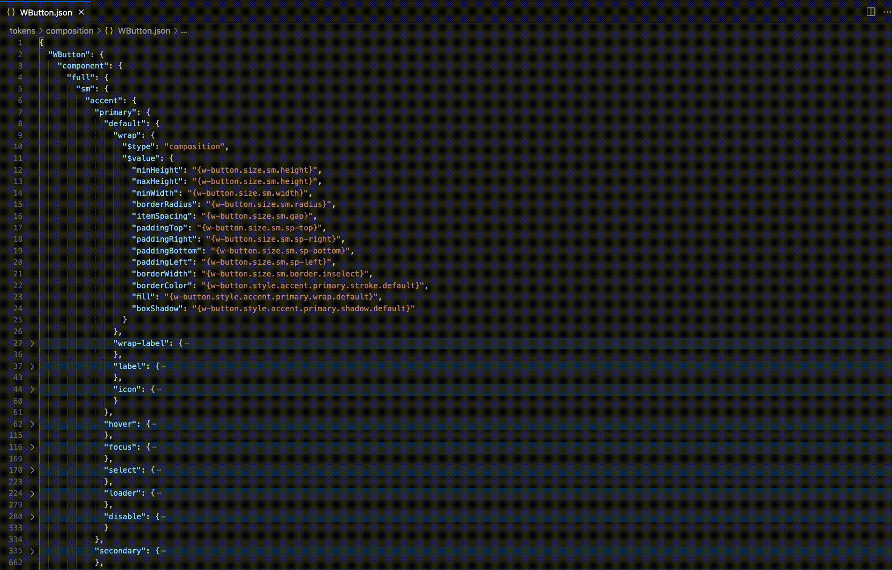

### 🟣 Typography Details
Shows fully resolved typography properties:
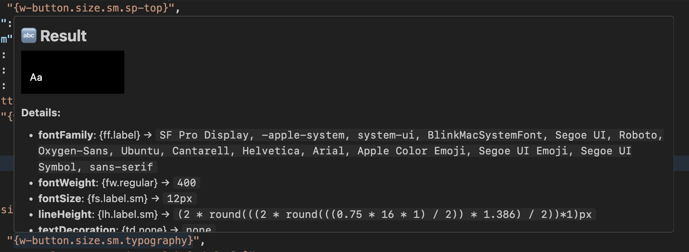

### 🎨 Color Tooltip
Instant color preview:
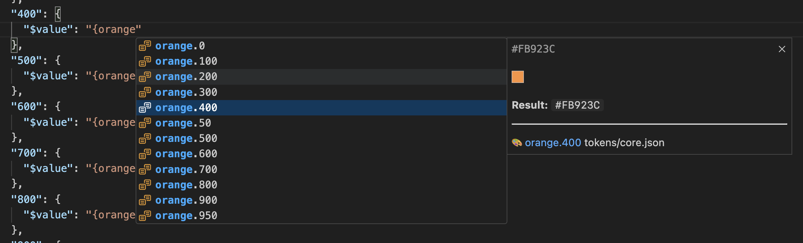

### 📏 Sizing Tooltip
Works with sizing tokens:
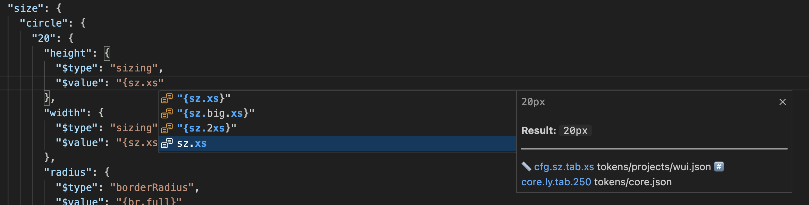

### ✨ Typography Autocomplete
Smart autocomplete with resolved tokens:
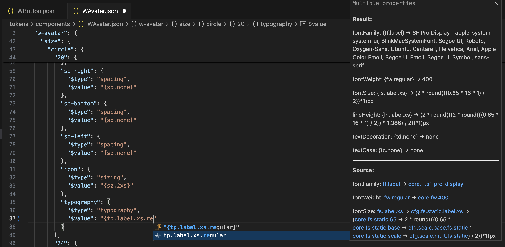

### ☁️ Box Shadow Source
See how complex boxShadow compositions resolve:
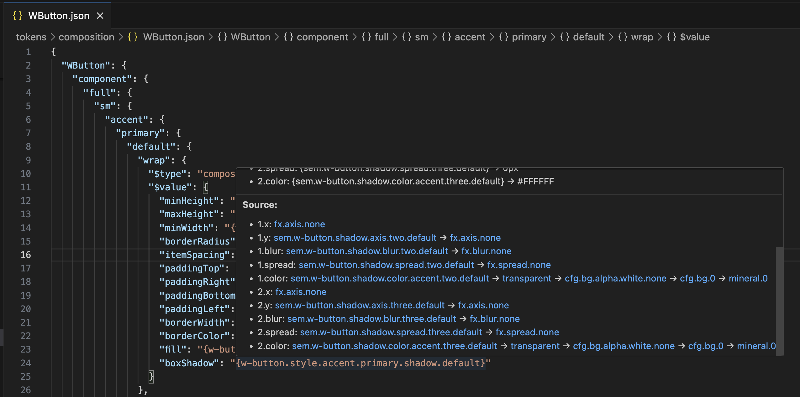

### ☁️ Box Shadow Result
Full visualization of box shadow chain:
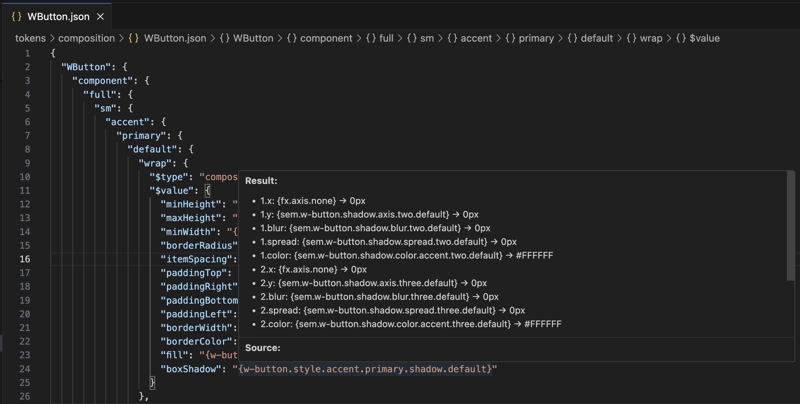

### 🎨 Color Resolution
Resolve color composition with full trace:
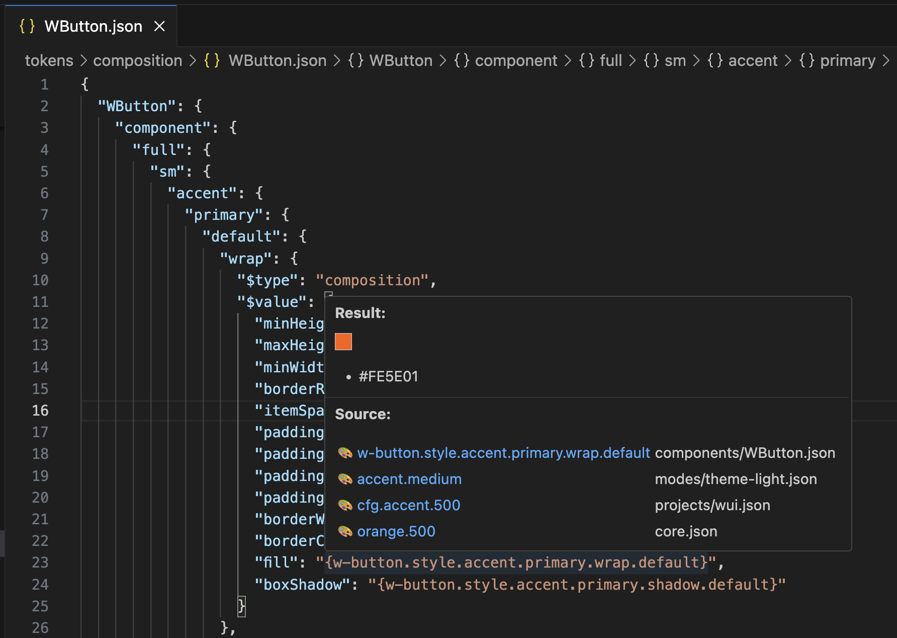

### 🎨 Gradient Resolution
Resolve gradient composition with full trace:
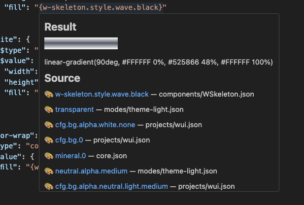

### 🎨 Color Modifiers Resolution
Resolve alpha, mix composition with full trace:
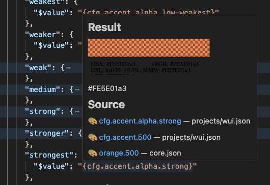

### 📐 Dimension Tooltip
See all dimensions calculated:
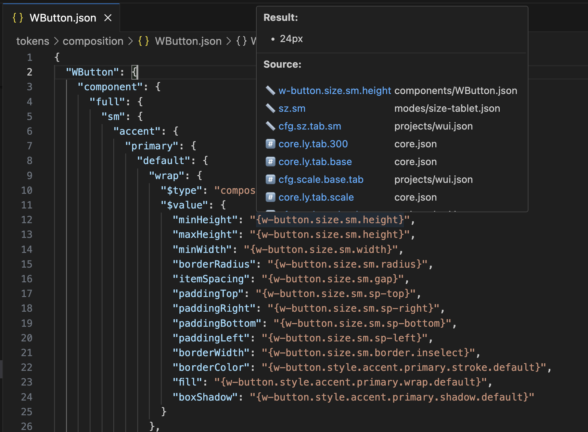

### ➕ Sizing Chain
Full resolution chain for sizing:
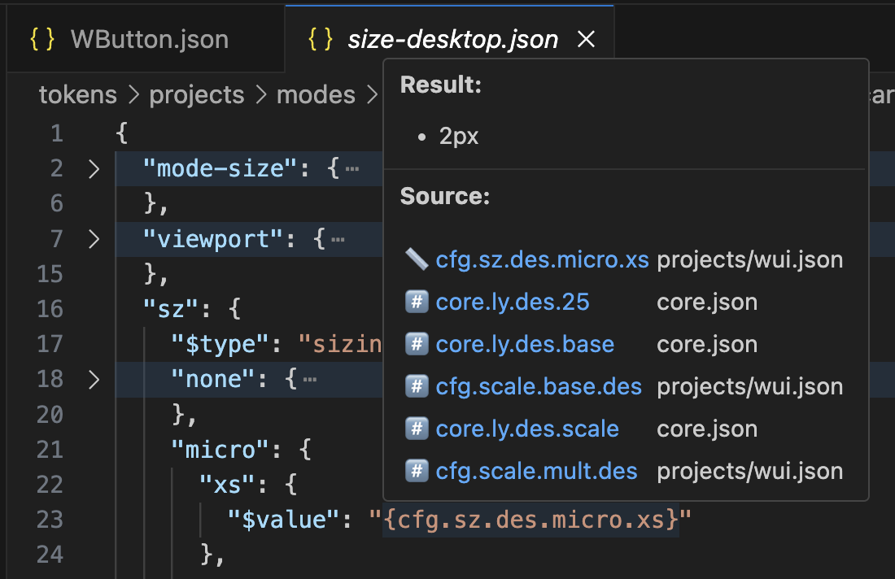

---

## ⚙️ Extension Settings

The extension supports the following settings, which you can configure in the VSCode settings:

| Setting                               | Description                                                                                                        | Default                                                            |
| ------------------------------------- | ------------------------------------------------------------------------------------------------------------------ | ------------------------------------------------------------------ |
| `jsonhintTs.tooltipBackgroundColor`   | Background color for the token tooltip view.                                                                       | `#1e1e1e`                                                          |
| `jsonhintTs.tooltipTextColor`         | Text color for the token tooltip view.                                                                             | `#d4d4d4`                                                          |
| `jsonhintTs.tooltipFontSize`          | Font size for the token tooltip text.                                                                              | `14px`                                                             |
| `jsonhintTs.tooltipAnimationDuration` | Animation duration (fade-in) for displaying token tooltips.                                                        | `0.3s`                                                             |
| `jsonhintTs.inheritanceStyle`         | Style for displaying the token inheritance chain:  • `compact` – concise,  • `table` – displayed as a table. | `compact`                                                          |
| `jsonhintTs.showIcons`                | Flag that determines whether to show icons for token types in tooltips.                                            | `true`                                                             |
| `jsonhintTs.showArrows`               | Flag to enable displaying arrows between tokens in the inheritance chain.                                          | `true`                                                             |
| `jsonhintTs.complexTypes`             | Array of token types that use an extended display format (e.g., table).                                            | `["typography", "boxShadow", "composition"]`                       |
| `jsonhintTs.noisyTokens`              | Array of tokens to exclude from the inheritance chain (noisy tokens).                                              | `["core.ly.tab.base", "cfg.scale.base.tab", "cfg.scale.mult.tab"]` |
| `jsonhintTs.maxChainLength`           | Maximum depth (number of steps) of the inheritance chain shown in the tooltip.                                     | `5`                                                                |
| `jsonhintTs.maxSuggestions`           | Maximum number of autocomplete suggestions to prevent UI lag.                                                      | `300`                                                              |
| `jsonhintTs.allowNoDollar`            | If set to `true`, the extension will recognize tokens defined without a leading `$` symbol.                         | `true`                                                             |

---

❤️ Credits
Thanks to the Tokens Studio team and community.
And also huge thanks to Gleb Rotachev ❤️.